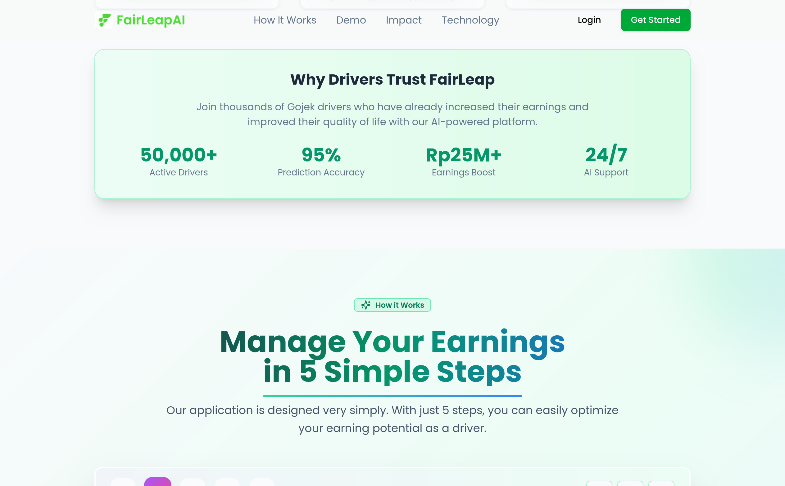
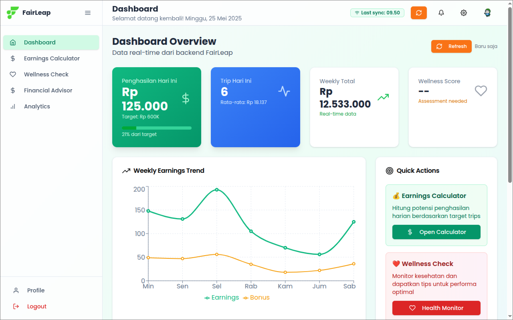

<p align="center">
  
  <h1 align="center">Fairleap AI - Frontend</h1>
</p>
   
## 📘 Project Overview
Fairleap AI is a platform designed to address income uncertainty and enhance the well-being of Gojek/GOTO drivers.

Fairleap AI is deployed on [fairleap.cloud](https://fairleap.cloud) and it's API (Back End) deployed on [api.fairleap.cloud](https://api.fairleap.cloud)

Fairleap AI Frontend Repository: [https://github.com/Fairleap-AI/fairleap-fe](https://github.com/Fairleap-AI/fairleap-fe)<br>
Fairleap AI API Backend Repository: [https://github.com/Fairleap-AI/fairleap-api](https://github.com/Fairleap-AI/fairleap-api)<br>
Fairleap AI RAG + AI Backend Repository: [https://github.com/Fairleap-AI/fairleap-ai](https://github.com/Fairleap-AI/fairleap-ai)

<p align="center">
  
  
  
  
  
  
  
  
  
  
  
  
  
  
  
  
  
  
  
  
  
  
  
  
  
  
  
  
  
  
</p>

## 🛠️ Tech Stacks

- **typescript**: A strongly typed programming language that builds on JavaScript.
- **react**: A JavaScript library for building user interfaces using components.
- **next**: A React framework that enables functionality such as server-side rendering and static site generation.
- **react-dom**: Serves as the entry point to the DOM and server renderers for React.
- **tailwindcss**: A utility-first CSS framework for rapidly building custom designs.
- **eslint**: A pluggable linter tool for identifying and fixing problems in JavaScript code.
- **@types/react / @types/react-dom**: Type definitions for React and React DOM.
- **@types/node**: TypeScript type definitions for Node.js runtime.
- **zod**: A TypeScript-first schema declaration and validation library.
- **react-hook-form**: A library for managing form state and validation in React applications.
- **@hookform/resolvers**: Utility package for integrating schema validation libraries with React Hook Form.
- **clsx**: A utility for conditionally joining classNames together.
- **class-variance-authority**: A utility for creating reusable class names with variant support in Tailwind CSS.
- **tailwind-merge**: Utility to intelligently merge Tailwind CSS classes.
- **tailwindcss-animate**: A plugin that provides animation utilities for Tailwind CSS.
- **postcss**: A tool for transforming CSS with JavaScript plugins.
- **eslint-config-next**: ESLint shareable config recommended for Next.js projects.
- **@eslint/eslintrc**: ESLint configuration tooling for managing and extending ESLint rules.
- **next-themes**: A theme toggler for Next.js apps with dark mode support.
- **@radix-ui/react-** (Accordion, Dialog, Tooltip, etc.)\*\*: A suite of low-level UI components built with accessibility and customization in mind.
- **vaul**: A dialog/modal component built on top of Radix UI primitives.
- **lucide-react**: An icon library for React that provides a consistent set of SVG icons.
- **react-icons**: Popular icon packs as React components.
- **recharts**: A composable charting library built on React components using D3 under the hood.
- **react-resizable-panels**: A set of flexible and resizable layout panels for React.
- **react-day-picker**: A flexible date picker component for React.
- **cmdk**: A command menu component for building fast, accessible command palettes in React.
- **sonner**: A lightweight and customizable toast notification library.
- **gsap**: A high-performance JavaScript animation library for creating complex animations with ease.
- **embla-carousel-react**: A performant and customizable carousel/slider library for React.
- **@stagewise/toolbar-next**: A customizable toolbar component optimized for Next.js apps.
- **date-fns**: A modern JavaScript date utility library that provides comprehensive, yet simple, date functions.
- **input-otp**: A component for handling one-time-password input fields with ease.


## ⚙️ Installation
To set up Fairleap AI API backend, start by clone the repository
   ```sh
   git clone https://github.com/Fairleap-AI/fairleap-fe
   cd fairleap-fe
   ```

To set up the Frontend locally, run:
   ```sh
   npm run dev
   ```

To deploy using Docker compose, run:
   ```sh
   docker compose up
   ```

## 📝 License
This project is licensed under the MIT License.